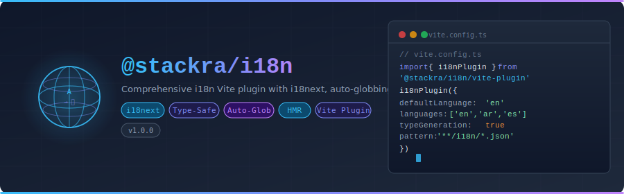

<p align="center">
  
</p>

<p align="center">
  <a href="https://www.npmjs.com/package/@stackra/react-i18n">
    
  </a>
  <a href="./LICENSE">
    
  </a>
</p>

---

## Overview

`@stackra/react-i18n` is a full-fledged internationalization system for React +
Vite projects. Built on **i18next**, it integrates with the
`@stackra/ts-container` DI system, the `@stackra/ts-http` middleware pipeline,
and follows the same architectural patterns as `@stackra/react-multitenancy`.

**Key highlights:**

- **DI Module** — `I18nModule.forRoot()` registers services, resolvers, and
  middleware
- **Injectable Service** — `I18nService` provides `t()`, `changeLocale()`,
  `resolveLocale()`, `isRTL()`
- **React Hooks** — `useLocale()`, `useTranslation()`, `useChangeLocale()`
- **Locale Resolver Chain** — pluggable resolvers (URL path, query param,
  storage, navigator, HTTP header)
- **HTTP Middleware** — `LocaleMiddleware` injects `Accept-Language` and syncs
  `Content-Language`
- **Vite Plugin** — auto-discovery, type generation, HMR for translation files
- **Zero-import globals** — `__('key')`, `t('key')` available on `globalThis`

---

## Installation

```bash
pnpm add @stackra/react-i18n
```

**Peer dependencies:** `vite`, `@stackra/ts-container`, `@stackra/ts-http`
(optional, for middleware).

---

## Architecture

```
I18nModule.forRoot(config)
  ├── I18N_CONFIG          — merged module configuration
  ├── I18NEXT_SERVICE      — I18nextService (i18next singleton wrapper)
  ├── LOCALE_RESOLVER_CHAIN — composed resolver chain function
  ├── I18N_SERVICE         — I18nService (high-level @Injectable)
  ├── 5 resolver tokens    — factory-created from config
  └── LocaleMiddleware     — @HttpMiddleware for HTTP pipeline

<I18nProvider service={i18nService}>
  ├── resolves initial locale on mount
  ├── useLocale()          — { locale, languages, isRTL }
  ├── useTranslation()     — { t, __, trans }
  └── useChangeLocale()    — { changeLocale, isChanging, error }
```

---

## Module Setup

```typescript
import { Module } from '@stackra/ts-container';
import { I18nModule } from '@stackra/react-i18n';

@Module({
  imports: [
    I18nModule.forRoot({
      defaultLanguage: 'en',
      languages: ['en', 'ar', 'es'],
      resolvers: ['url-path', 'storage', 'navigator'],
      storageKey: 'i18nextLng',
      queryParam: 'lang',
    }),
  ],
})
export class AppModule {}
```

---

## React Provider Setup

```tsx
import { ContainerProvider } from '@stackra/ts-container';
import { I18nProvider } from '@stackra/react-i18n';

// I18nProvider uses useInject(I18N_SERVICE) internally —
// just nest it inside ContainerProvider, no manual wiring needed.
// RTL direction (document.dir) and document.lang are set automatically.
const App = () => (
  <ContainerProvider context={app}>
    <I18nProvider>
      <MyApp />
    </I18nProvider>
  </ContainerProvider>
);
```

---

## Hooks

### useTranslation

```tsx
import { useTranslation } from '@stackra/react-i18n';

const Greeting = () => {
  const { t } = useTranslation();
  return <h1>{t('greeting', { name: 'John' })}</h1>;
};
```

### useLocale

```tsx
import { useLocale } from '@stackra/react-i18n';

const LanguageInfo = () => {
  const { locale, languages, isRTL } = useLocale();
  return <div dir={isRTL ? 'rtl' : 'ltr'}>Current: {locale}</div>;
};
```

### useChangeLocale

```tsx
import { useLocale, useChangeLocale } from '@stackra/react-i18n';

const LanguageSwitcher = () => {
  const { locale, languages } = useLocale();
  const { changeLocale, isChanging } = useChangeLocale();

  return (
    <select
      value={locale}
      onChange={(e) => changeLocale(e.target.value)}
      disabled={isChanging}
    >
      {languages.map((lang) => (
        <option key={lang} value={lang}>
          {lang}
        </option>
      ))}
    </select>
  );
};
```

---

## Injecting the Service

```typescript
import { Injectable, Inject } from '@stackra/ts-container';
import { I18N_SERVICE } from '@stackra/react-i18n';
import type { II18nService } from '@stackra/react-i18n';

@Injectable()
class NotificationService {
  constructor(@Inject(I18N_SERVICE) private i18n: II18nService) {}

  notify(key: string): void {
    showToast(this.i18n.t(key));
  }
}
```

---

## Locale Resolvers

Resolvers detect the user's locale from various sources. They are tried in
priority order (lower = higher priority). The first to return a value wins.

| Priority    | Resolver          | Source                            |
| ----------- | ----------------- | --------------------------------- |
| 1 (HIGHEST) | `url-path`        | URL path segment (`/ar/products`) |
| 2 (HIGH)    | `query-param`     | Query parameter (`?lang=ar`)      |
| 3 (NORMAL)  | `storage`         | localStorage / sessionStorage     |
| 4 (LOW)     | `accept-language` | Stored HTTP response header       |
| 5 (LOWEST)  | `navigator`       | Browser `navigator.language`      |

### Custom Resolvers

```typescript
import type { ILocaleResolver } from '@stackra/react-i18n';
import { LocaleResolverPriority } from '@stackra/react-i18n';

class JwtLocaleResolver implements ILocaleResolver {
  name = 'jwt';
  priority = LocaleResolverPriority.HIGHEST;

  resolve(): string | undefined {
    const token = getAccessToken();
    return token ? decodeJwt(token).locale : undefined;
  }
}

// Register in module config
I18nModule.forRoot({
  resolvers: ['jwt', 'url-path', 'storage', 'navigator'],
  customResolvers: { jwt: new JwtLocaleResolver() },
});
```

---

## HTTP Middleware

The `LocaleMiddleware` integrates with `@stackra/ts-http`:

- Injects `Accept-Language` header on every outgoing request
- Reads `Content-Language` from API responses and syncs back
- Opt out per-request with `meta: { skipLocale: true }`

Registered automatically by `I18nModule.forRoot()`. Uses
`@HttpMiddleware({ priority: 15 })`.

---

## Vite Plugin

For build-time translation scanning (separate from the DI system):

```typescript
import { defineConfig } from 'vite';
import { i18nPlugin } from '@stackra/react-i18n';

export default defineConfig({
  plugins: [
    i18nPlugin({
      defaultLanguage: 'en',
      languages: ['en', 'ar', 'es'],
      typeGeneration: true,
    }),
  ],
});
```

Features: auto-discovery via glob, TypeScript type generation, HMR for
translation files, virtual module (`virtual:@stackra/react-i18n`).

---

## Module Options

| Option             | Type                              | Default                    | Description                   |
| ------------------ | --------------------------------- | -------------------------- | ----------------------------- |
| `defaultLanguage`  | `string`                          | `'en'`                     | Fallback language             |
| `languages`        | `string[]`                        | `['en']`                   | Supported language codes      |
| `resolvers`        | `string[]`                        | `['storage', 'navigator']` | Active resolver names         |
| `customResolvers`  | `Record<string, ILocaleResolver>` | `{}`                       | Custom resolver instances     |
| `queryParam`       | `string`                          | `'lang'`                   | Query parameter name          |
| `storageKey`       | `string`                          | `'i18nextLng'`             | localStorage key              |
| `requestHeader`    | `string`                          | `'Accept-Language'`        | Outgoing request header       |
| `responseHeader`   | `string`                          | `'content-language'`       | Incoming response header      |
| `syncFromResponse` | `boolean`                         | `true`                     | Sync locale from API response |
| `i18nextOptions`   | `Partial<I18nextOptions>`         | `{}`                       | Pass-through i18next config   |
| `debug`            | `boolean`                         | `false`                    | Enable debug logging          |

---

## DI Tokens

| Token                             | Resolves To                                  |
| --------------------------------- | -------------------------------------------- |
| `I18N_CONFIG`                     | `I18nModuleOptions` — merged config          |
| `I18N_SERVICE`                    | `I18nService` — high-level service           |
| `I18NEXT_SERVICE`                 | `I18nextService` — low-level i18next wrapper |
| `LOCALE_RESOLVER_CHAIN`           | `() => Promise<string \| undefined>`         |
| `URL_PATH_LOCALE_RESOLVER`        | `UrlPathLocaleResolver`                      |
| `QUERY_PARAM_LOCALE_RESOLVER`     | `QueryParamLocaleResolver`                   |
| `STORAGE_LOCALE_RESOLVER`         | `StorageLocaleResolver`                      |
| `NAVIGATOR_LOCALE_RESOLVER`       | `NavigatorLocaleResolver`                    |
| `ACCEPT_LANGUAGE_LOCALE_RESOLVER` | `AcceptLanguageLocaleResolver`               |

---

## License

MIT
